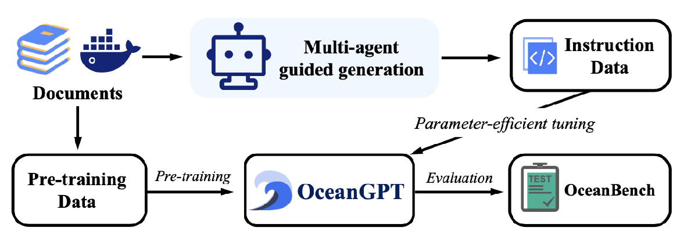

<div align="center">


**OceanGPT: A Large Language Model for Ocean Science Tasks**

<p align="center">
  <a href="https://github.com/zjunlp/OceanGPT">Project</a> •
  <a href="https://arxiv.org/abs/2310.02031">Paper</a> •
  <a href="https://huggingface.co/collections/zjunlp/oceangpt-664cc106358fdd9f09aa5157">Models</a> •
  <a href="http://oceangpt.zjukg.cn/#model">Web</a> •
  <a href="#overview">Overview</a> •
  <a href="#quickstart">Quickstart</a> •
  <a href="#citation">Citation</a>
</p>

[](https://opensource.org/licenses/MIT)
 

</div>

## Table of Contents

- <a href="#news">What's New</a>
- <a href="#overview">Overview</a>
- <a href="#quickstart">Quickstart</a>
- <a href="#models">Models</a>
- <a href="#citation">Citation</a>

## 🔔News
- **2024-07-04, We release OceanGPT-14B/2B-v0.1 and OceanGPT-7B-v0.2**
- **2024-06-04, [OceanGPT](https://arxiv.org/abs/2310.02031) is accepted by ACL 2024. 🎉🎉**
---

This repository is a subproject of [KnowLM](https://github.com/zjunlp/KnowLM).

## 🌟Overview

This is the OceanGPT project, which aims to build LLMs for ocean science tasks.


## ⏩Quickstart
### Download the model

Download the model: [OceanGPT-14B-v0.1](https://huggingface.co/zjunlp/OceanGPT-14B-v0.1) or [
OceanGPT-7b-v0.2](https://huggingface.co/zjunlp/OceanGPT-7b-v0.2)

```shell
git lfs install
git clone https://huggingface.co/zjunlp/OceanGPT-14B-v0.1
```
or
```
huggingface-cli download --resume-download zjunlp/OceanGPT-14B-v0.1 --local-dir OceanGPT-14B-v0.1 --local-dir-use-symlinks False
```
### Inference

```python
from transformers import AutoModelForCausalLM, AutoTokenizer
import torch
device = "cuda" # the device to load the model onto
path = 'YOUR-MODEL-PATH'
model = AutoModelForCausalLM.from_pretrained(
    path,
    torch_dtype=torch.bfloat16,
    device_map="auto"
)
tokenizer = AutoTokenizer.from_pretrained(path)

prompt = "Which is the largest ocean in the world?"
messages = [
    {"role": "system", "content": "You are a helpful assistant."},
    {"role": "user", "content": prompt}
]
text = tokenizer.apply_chat_template(
    messages,
    tokenize=False,
    add_generation_prompt=True
)
model_inputs = tokenizer([text], return_tensors="pt").to(device)

generated_ids = model.generate(
    model_inputs.input_ids,
    max_new_tokens=512
)
generated_ids = [
    output_ids[len(input_ids):] for input_ids, output_ids in zip(model_inputs.input_ids, generated_ids)
]

response = tokenizer.batch_decode(generated_ids, skip_special_tokens=True)[0]
```

## 📌Models

| Model Name        | Huggingface Checkpoints                                                           | Wisemodel Checkpoints                                                                  | Modelscope Checkpoints                                                                   |
|-------------------|-----------------------------------------------------------------------------------|----------------------------------------------------------------------------------------|-----------------------------------------------------------------------------------------|
| OceanGPT-14B-v0.1 | <a href="https://huggingface.co/zjunlp/OceanGPT-14B-v0.1" target="_blank">14B</a> | <a href="https://wisemodel.cn/models/zjunlp/OceanGPT-14B-v0.1" target="_blank">14B</a> | <a href="https://modelscope.cn/models/ZJUNLP/OceanGPT-14B-v0.1" target="_blank">14B</a> |
| OceanGPT-7B-v0.2  | <a href="https://huggingface.co/zjunlp/OceanGPT-7b-v0.2" target="_blank">7B</a>   | <a href="https://wisemodel.cn/models/zjunlp/OceanGPT-7b-v0.2" target="_blank">7B</a>   | <a href="https://modelscope.cn/models/ZJUNLP/OceanGPT-7b-v0.2" target="_blank">7B</a>   |
| OceanGPT-2B-v0.1  | <a href="https://huggingface.co/zjunlp/OceanGPT-2B-v0.1" target="_blank">2B</a>   | <a href="https://wisemodel.cn/models/zjunlp/OceanGPT-2b-v0.1" target="_blank">2B</a>   | <a href="https://modelscope.cn/models/ZJUNLP/OceanGPT-2B-v0.1" target="_blank">2B</a>   |
| OceanGPT-V  | To be released                                                                    | To be released                                                                         | To be released                                                                          |
---
### 🚩Citation

Please cite our repository if you use EasyInstruct in your work.

```bibtex
@article{bi2023oceangpt,
  title={OceanGPT: A Large Language Model for Ocean Science Tasks},
  author={Bi, Zhen and Zhang, Ningyu and Xue, Yida and Ou, Yixin and Ji, Daxiong and Zheng, Guozhou and Chen, Huajun},
  journal={arXiv preprint arXiv:2310.02031},
  year={2023}
}

@misc{knowlm,
  author = {Ningyu Zhang and Jintian Zhang and Xiaohan Wang and Honghao Gui and Kangwei Liu and Yinuo Jiang and Xiang Chen and Shengyu Mao and Shuofei Qiao and Yuqi Zhu and Zhen Bi and Jing Chen and Xiaozhuan Liang and Yixin Ou and Runnan Fang and Zekun Xi and Xin Xu and Lei Li and Peng Wang and Mengru Wang and Yunzhi Yao and Bozhong Tian and Yin Fang and Guozhou Zheng and Huajun Chen},
  title = {KnowLM: An Open-sourced Knowledgeable Large Langugae Model Framework},
  year = {2023},
 url = {http://knowlm.zjukg.cn/},
}
```

---